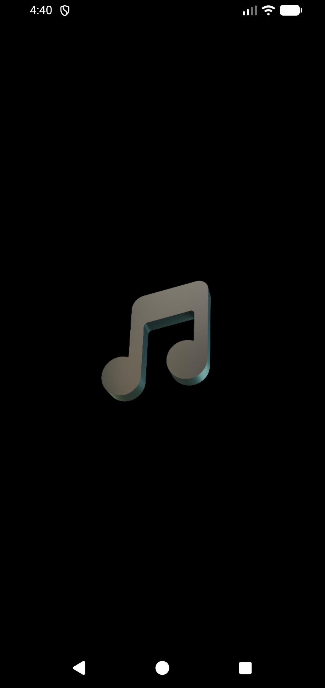
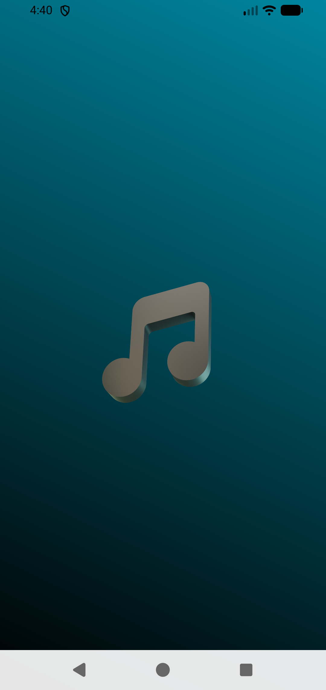
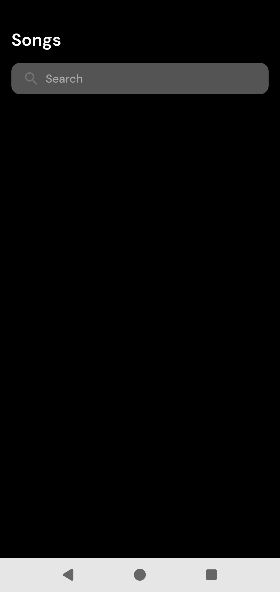
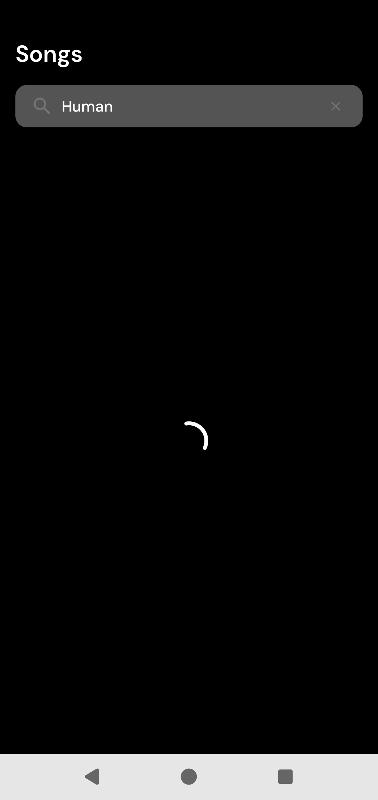
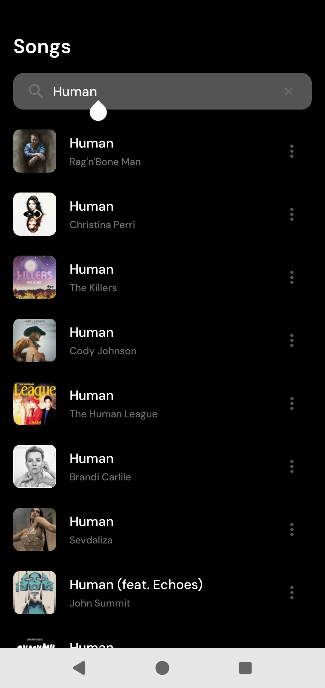
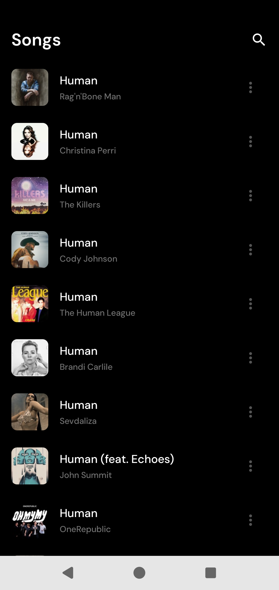
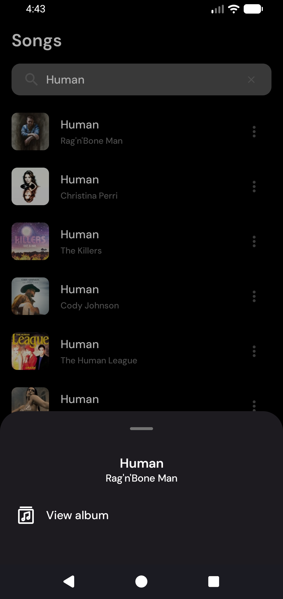
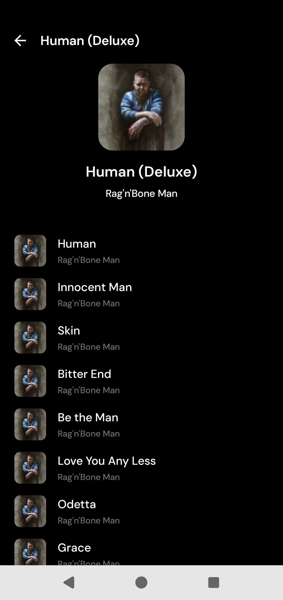

# Moises AI Challenge: Music Player

## Description

Technical challenge for Moises AI as
described [here](https://moisesai.notion.site/Android-Phone-Code-Challenge-327143d9131080278948d0f5a77a2103).

* Created the Songs screen
    * This is the app's Home screen, after calling it the Songs screen I questioned this choice
* Implemented the Song search which populates the Songs screen with Song items
    * Search is backed by the iTunes Search API
        * But not coupled to it
    * Song items are reused in the Album Details screen as well
        * And populated with data from the iTunes Search API as well
* Created the Song Action bottom sheet
    * Which contains the option to view that song's album
* Created the Album Details screen
    * Which shows some information about the album
    * And shows a list of the songs in the album
        * Which reuses the Song items from before
* Created the Splash screen
    * Which starts as the app's background (black background + icon), then transitions to a screen
      with an animated gradient

### Tech Detailing

* MVVM + Clean Architecture
    * The number of layers was chosen so that there wouldn't be so much of the boilerplate that
      comes with passing data between layers
        * There's a central **domain** layer (and module) that merges the two innermost layers of
          Clean Arch and would be separated by domain (in this app there's just Music)
            * Though I separate the module into two packages (`entity` and `usecase`) which could
              become separate modules
        * There's a **data** layer (and module) that encapsulates the iTunes Search API
            * I tried my best to not leak any implementation detail of the API into the rest of the
              app so that iTunes could be replaced with another API relatively easily
            * This is also where Room would live
        * And there's a **presentation** layer (and module) that has both the MVVM parts and Jetpack
          Compose
            * This layer is separated into modules in a way to allow reusability (such as Song
              items) and is separated by domain (so Song (item and ~~details~~), Album (only
              details), and so on)
            * This layer also has some Android plumbing like theming and the Splash screen
    * So:
        * The **domain** layer declares domain types and use cases (application rules)
        * The latter implement Input Ports and use Gateways to get their dependencies
        * Input Ports are the interfaces on which ViewModels depend and use to communicate with the
          rest of the app
        * Gateways are the interfaces implemented by Repositories in the **data** layer so they can
          fulfill app needs
        * Repositories choose from what Data Source they should get data
        * This data is returned to ViewModels, which save them to `Flow`s, which the UI observes
* Tools:
    * Coil
    * Koin
    * Retrofit + Coroutines + Kotlin Serialization
    * Jetpack Compose + Navigation + Paging 3
    * ViewModel + Flow
    * Ktlint

### Screenshots

| Splash                                  |                                         |
|-----------------------------------------|-----------------------------------------|
|  |  |

| Songs                                                 |                                                         |
|-------------------------------------------------------|---------------------------------------------------------|
|        |      |
|  |  |

| Album Details                                                 |                                                     |
|---------------------------------------------------------------|-----------------------------------------------------|
|  |  |

### Running the app

It should be plug-and-play with Android Studio.

* I used:
    * Android Studio Panda 4 | 2025.3.4 Patch 1
    * Java 11
    * Kotlin 2
    * **Note:** I developed on Windows, sorry in advance for encoding issues

Just in case, I also committed an APK, here [app-debug.apk](apk/app-debug.apk), you can install with
`adb install <path to this repo>/apk/app-debug.apk`

### Choices

* According to multiple sources I found, the iTunes Search API supports paging by passing the
  `offset` parameter, but I tried a lot and it didn't work
    * So I went with the bad paging option: load larger and larger chunks and drop the already
      loaded ones to avoid competition
    * I wanted to have some sort of Dev menu so one could choose what paging strategy to use, but I
      couldn't get to it

### Missing (cut due to time)

* Tests
    * I promise I care about testing and that I'm very thorough, but with the size of the challenge
      and other responsibilities I have, I lowered their priority and ended up not having time at
      the end
* Song Details screen
    * My plan was to add a copyright-free music asset to simulate playing song
* Song history in the Songs screen
    * I intended to use Room to keep a small list (like up to 50 entries) of the songs the user has
      played
    * I also thought of having a delete button (like a swipe from the side) to remove songs from the
      history
    * And I thought of having some sort of auto update where saved song data is updated on startup
* Caching

### Known bugs

* Some albums have no songs in the API, but I populate the Album Details screen by fetching an
  Album's songs and showing the Album information from its first song
    * So when opening the Album Details screen for an Album with no songs, the Error state is shown
* Navigating back from the Album Details screen clears the Search input (and results)
* The app resets on configuration changes
